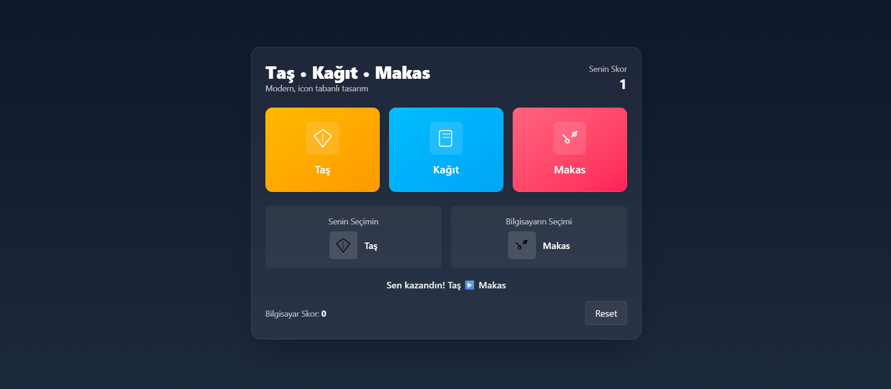

# 🪨 Taş • Kağıt • Makas (Rock Paper Scissors Game)

Bu proje, React + TypeScript + Tailwind CSS** kullanılarak geliştirilmiş modern bir Taş, Kağıt, Makas oyunudur.  
Kullanıcı bilgisayara karşı oynar. Her turda seçimler, skorlar ve sonuç dinamik olarak ekranda gösterilir.  
Arayüz sade, modern ve kullanıcı dostu olacak şekilde tasarlanmıştır.

## 🚀 Özellikler
✅ Dinamik skor sistemi  
✅ Bilgisayarın rastgele seçim algoritması  
✅ TypeScript ile güçlü tip güvenliği  
✅ Tailwind CSS ile responsive modern tasarım  
✅ Reset butonuyla skor sıfırlama özelliği  

## 🛠️ Kurulum

git clone https://github.com/

🧩 Teknolojiler

⚛️ React 18
⛑️ TypeScript
🎨 Tailwind CSS
🧠 React Hooks (useState)
